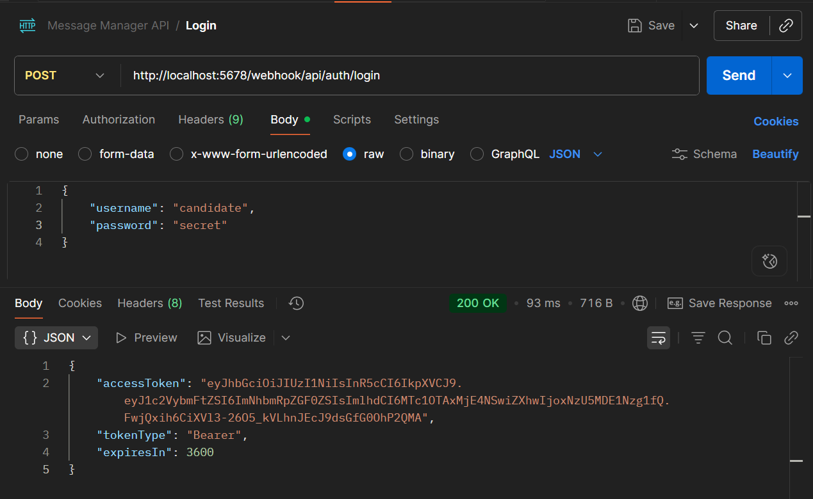
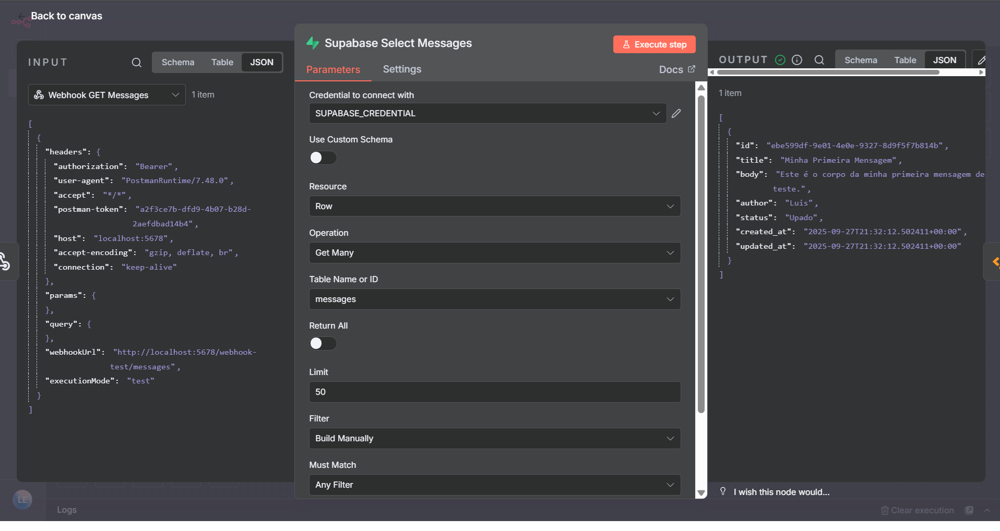
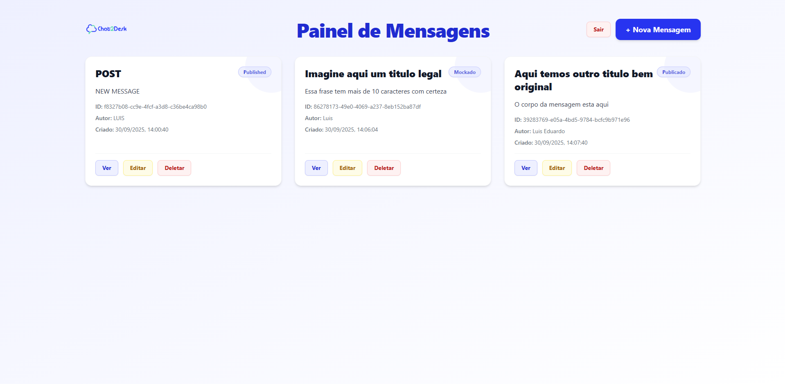

# Technical Test – Chat2Desk (Frontend + n8n + Supabase)

Aplicação full-stack minimalista e moderna para CRUD de Mensagens:

- Frontend SPA em React + Vite + TypeScript, estilizado com Tailwind CSS e servido por Nginx
- Backend orquestrado via n8n (webhooks) com autenticação via JWT
- Persistência em Supabase (Postgres)
- Orquestração via Docker Compose

Este guia cobre do zero: preparação de ambiente, variáveis `.env`, criação do schema no Supabase, importação do fluxo n8n, teste com Postman e execução com Docker Compose.

## Requisitos

- Docker e Docker Compose instalados
- Node 18+ (apenas se quiser rodar o frontend localmente fora do Docker)
- Conta Supabase (gratuita) ou um Postgres equivalente
- Postman (opcional, para testar os endpoints)

## Variáveis de ambiente (.env)

Crie um arquivo `.env` na raiz do projeto (mesmo nível do `docker-compose.yml`). Exemplo funcional fornecido:

```
# Configurações básicas do n8n
N8N_HOST=localhost
N8N_PORT=5678
N8N_PROTOCOL=http

# Autenticação do n8n
N8N_USERNAME=user
N8N_PASSWORD=password

# Criptografia (sempre fixo)
N8N_ENCRYPTION_KEY=6b5e1d6b83e34c6a9f03c3e93a9e5f19

# Banco Postgres (se quiser usar interno/externo)
POSTGRES_DB=taskmanager
POSTGRES_USER=user
POSTGRES_PASSWORD=password

# JWT para autenticação de API
JWT_SECRET=9a2d8f6d7c1340b68f621aa2c3d49e41

SUPABASE_URL=
SUPABASE_ANON_KEY=
SUPABASE_SERVICE_ROLE_KEY=
```

Anotações:

- SUPABASE_URL, SUPABASE_ANON_KEY e SUPABASE_SERVICE_ROLE_KEY devem vir do seu projeto no Supabase (Configurações > API).
- O JWT_SECRET é usado no n8n para assinar tokens de autenticação simples do frontend.
- O n8n usa N8N_ENCRYPTION_KEY para criptografar credenciais internas; mantenha-o fixo e seguro.

Frontend (.env do frontend):

- Dentro da pasta `frontend`, há uma variável de ambiente consumida pelo Vite:
  - `VITE_API_BASE=http://localhost:5678/webhook`
- Você pode configurar via `.env` dentro de `frontend/` ou via arquivo `.env.local`. O código já usa `import.meta.env.VITE_API_BASE` e faz fallback para `http://localhost:5678/webhook`.

## Banco de Dados (Supabase)

1. Crie um projeto no Supabase e copie as chaves/URL (preencha no `.env`).

2. Importe o schema SQL do projeto (tabela `messages` e trigger):

- Arquivo: `db/schema.sql`
- No Supabase, vá em SQL Editor > cole o conteúdo do arquivo e execute.

Conteúdo do schema (resumo):

- Tabela `messages` com colunas: id (uuid), title, body, author, status, created_at, updated_at
- Trigger para atualizar automaticamente o `updated_at` em updates

Observação: O script usa `gen_random_uuid()`. Em alguns ambientes é necessário habilitar a extensão `pgcrypto` ou `uuid-ossp`. No Supabase, `gen_random_uuid()` costuma estar disponível. Se necessário, rode antes:

```
-- se precisar
create extension if not exists pgcrypto;
```

## Fluxo no n8n (importação do workflow)

1. Suba o n8n (veja seção “Subir com Docker Compose”). Ao abrir http://localhost:5678, faça login com N8N_USERNAME/N8N_PASSWORD definidos no `.env`.

2. Importe o workflow do repositório:

- Arquivo: `n8n/flows.json`
- No n8n, clique em “Import from File” e selecione esse arquivo.
- Ative o workflow.

3. Geração automática de endpoints no n8n (IDs únicos):

- O n8n cria webhooks com caminhos que incluem um UUID único por nó. Por isso, cada operação (GET, PUT, DELETE) pode ter um caminho diferente, por exemplo:
  - GET by ID: `http://localhost:5678/webhook/e8b452ab-d339-48be-9700-56e77fa619db/api/messages/:id`
- Se você acessar direto pelo n8n (sem o frontend), precisará ajustar esses UUIDs nas URLs das requisições que fizer. No frontend, esses IDs já estão referenciados no arquivo `frontend/src/api/client.ts` e você pode trocá-los caso seu n8n gere outros IDs ao importar o fluxo.

## Endpoints principais (via n8n)

Base URL (produção local do n8n): `http://localhost:5678/webhook`

- Login: `POST /login` (retorna accessToken)
- Listar mensagens: `GET /messages` (o n8n retorna array no formato [{ json: {...} }], o frontend “desembrulha” para objetos puros)
- Buscar por ID: `GET /e8b452ab-d339-48be-9700-56e77fa619db/api/messages/:id` ← ajuste o UUID conforme o seu n8n
- Criar: `POST /api/messages/`
- Atualizar: `PUT /3621eaf5-1083-4274-bc9f-21599eecab9e/api/messages/:id` ← ajuste o UUID
- Deletar: `DELETE /4517e62a-2edd-42db-8f73-3f5bc20f3773/api/messages/:id` ← ajuste o UUID

Observação importante

- Esses caminhos com UUID são gerados pelo n8n. Se o seu ambiente gerar IDs diferentes, atualize o arquivo `frontend/src/api/client.ts` nos métodos `getMessageById`, `updateMessage`, `deleteMessage` para bater com as suas rotas.

## Testes com Postman

Há uma collection pronta em `collection/postman-collection.json`.

1. Importe a collection no Postman.
2. Configure a variável `baseUrl` como `http://localhost:5678/webhook`.
3. Execute a requisição “Login and Get Token” em Auth; o script de test salva `accessToken` automaticamente em variáveis da collection.
4. Teste as rotas de Messages:
   - Get All Messages: GET `{{baseUrl}}/messages`
   - Create Message: POST `{{baseUrl}}/api/messages` (ou o caminho com UUID se seu workflow exigir) – envie body JSON com title, body, author, status
   - Get/Update/Delete by ID: ajuste os paths com o UUID gerado pelo seu n8n, por exemplo:
     `{{baseUrl}}/e8b452ab-d339-48be-9700-56e77fa619db/api/messages/{{messageId}}`

Se preferir fazer chamadas manuais direto ao n8n, lembre-se de substituir o UUID pelo gerado no seu ambiente.

## Rodando a aplicação (Docker Compose)

1. Garanta que o `.env` na raiz esteja preenchido (ver seção Variáveis de ambiente).
2. Suba tudo:

```powershell
docker compose up --build
```

3. Acesse:

- Frontend: http://localhost:3000
- n8n: http://localhost:5678

O frontend é servido por Nginx com fallback para SPA (atualizar páginas de rota funciona). As páginas incluem Login, Lista (cards), Detalhe e Formulário (criar/editar). O fluxo completo usa o n8n como “backend” via webhooks.

## Rodando o frontend localmente (opcional)

```powershell
cd frontend
npm install
npm run dev
```

Opcionalmente crie `frontend/.env` com:

```
VITE_API_BASE=http://localhost:5678/webhook
```

## Estrutura do projeto

```
docker-compose.yml
README.md
db/
	schema.sql
frontend/
	Dockerfile
	nginx.conf
	package.json
	src/
		api/client.ts
		pages/
			LoginPage.tsx
			MessagesListPage.tsx
			MessageDetailPage.tsx
			MessageFormPage.tsx
n8n/
	flows.json
collection/
	postman-collection.json
images/
	sc1.png
	sc2.png
	sc3.png
```

## Seção de fotos (evolução do desenvolvimento)

Abaixo estão os principais screenshots em ordem cronológica do desenvolvimento:

1. Tela de Login (Auth)



2. Lista de Mensagens (CRUD integrado ao n8n)



3. Frontend - CRUD (fluxo completo)



## Notas técnicas do frontend

- Stack: React 19 + Vite 7 + TypeScript + React Router + React Hook Form + Zod + Axios + Tailwind CSS
- Build: multi-stage Docker (Node → Nginx). `nginx.conf` inclui fallback SPA.
- Autenticação simples: token salvo em `localStorage` como `authToken`.
- Client API (`frontend/src/api/client.ts`):
  - usa `import.meta.env.VITE_API_BASE` (fallback `http://localhost:5678/webhook`)
  - inclui helper para “desembrulhar” respostas n8n no formato `{ json: {...} }` para objetos planos
  - caminhos de GET/PUT/DELETE by ID incluem UUIDs gerados pelo n8n – ajuste conforme o seu workflow

## Troubleshooting

- “404 ao atualizar página”: O Nginx já está configurado com `try_files` fallback para SPA. Verifique `frontend/nginx.conf` e se a imagem foi rebuildada após mudanças.
- “Dados no formato [{ json: {...} }]”: O frontend já normaliza isso. Se você customizar o fluxo n8n e mudar o shape, ajuste o helper no `client.ts` (função `unwrapN8n`).
- “UUIDs das rotas não batem”: Atualize as rotas em `client.ts` com os UUIDs do seu n8n (veja no editor do workflow os endpoints exatos de cada Webhook node).
- “gen_random_uuid() não existe”: habilite a extensão `pgcrypto` no Postgres/Supabase (veja seção Banco de Dados).

## Licença

Uso livre para fins de teste/técnico.
